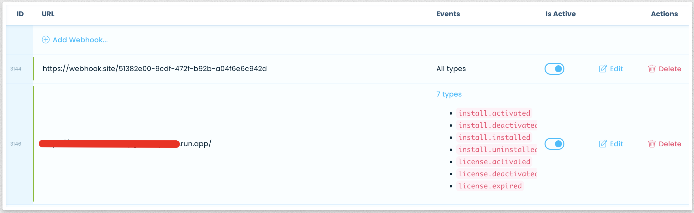

# What it does 🤔

Coach Freem receives your webhooks from Freemius, dusts them off, gives them a pep talk, and then sends them off to Mautic (he doesn't know that he's an app).

# Why 🤷🏾‍♂️

Because automation.

# How to use it 🛠️

Coach Freem was intended to be run as a Google Cloud Function that comes up every time the various webhooks are sent by Freemius. Google Cloud functions has a nice free tier so there's that.

Coach isn't limited to Google Cloud Functions, he can easily be moved to your very own server with a few tweaks. All you'd need to do is create a route on your server/website that accepts POST requests, and pass that request body to Coach. 
That pretty much happens on the first few lines of the `init` function. You can use a framework such as [SlimPHP](https://www.slimframework.com/) if you'd like to go that route.

Coach makes use of Mautic's Basic Auth, so all you need to do is create an Admin user on your Mautic install and change the details in `setClient` method, inside `Client.php` in the `includes` folder. You also need to enable the REST API on your Mautic install.

By default the method expects environment variables for these values, but you can set the details manually for testing or actually set them inside your $PATH.

In production you'd set the set environment variables inside the Google Functions config.

## Composer

On your localhost run `composer install` inside the root folder of Coach Freem.
## Google Functions Setup

You may manually upload the source to the Google Cloud Functions dashboard but ideally you can make use of the Google Cloud SDK to deploy and redeploy new versions.

Install the Google Cloud sdk. If you're using MacOS then you can do so using [Homebrew](https://formulae.brew.sh/cask/google-cloud-sdk).

You can deploy the new version by running `composer deploy`. This will start the deploy steps and you may be asked for Google Cloud Credentials if you've never connected via command line before.

## Local Testing

You can start a local PHP server for testing your changes by running `composer start`, you will then be able to access Coach locally by going to `http://localhost:8080`. You can then `POST` Freemius webhooks to this URL using a tool like [Insomnia](https://insomnia.rest/) or [Postman](https://www.postman.com/).

An example Freemius request webhook can be found in `docs/sample-freemius-webhook.json`, simply copy the contents of this file and paste it as a JSON POST request inside Insomnia/Postman to `http://localhost:8080`.

You can change the `type` key in the JSON request to the webhook you want to test. 

For your own plugin/theme, you can use the Freemius webhook area to send all webhooks to a URL provided by https://webhook.site/ to examine the webhook content testing.

## Freemius dashboard setup

Once you've deployed Coach Freem to Google Cloud Functions, you should get a URL where it can be accessed:

Copy this URL and head to `Freemius Dashboard->Integrations->Custom Webhooks`, create a new webhook with the URL you copied before but for the event types **ONLY SELECT THE CURRENT EVENTS THAT ARE BEING CONSUMED BY COACH FREEM**. Selecting "all event types" would send every single Freemius event type to your Cloud Function causing unnecessary charges.

At the time of writing this line the only events being used by Coach Freem are:

- install.installed
- license.activated
- license.deactivated
- license.expired
- install.activated
- install.deactivated
- install.uninstalled

You can confirm this by checking the `init()` function in `index.php`. 

Your webhook should look something like this:

In the image above you can see that we're sending all events to https://webhook.site, this is simply for testing purposes as mentioned above. You can turn off the webhook.site webhook once you're done testing.
## Functions to edit before going live

The following functions inside `index.php` should be edited to match your plugin and mautic details:

- customContactDataMappings()
- contactSegments()
- contactTags()
- excludedTLDs()
- isExcludedTLD()

Comments have been added to help explain how these functions should be edited. If comments can be made better then feel free to submit a pull request! 

# What's missing 👨🏾‍💻

Well...I put this together to *just* get some automation set up for Mautic to further automate my email marketing (the whole reason I'm using it). So pull requests are welcome.

Missing:

- Handle when a user opts out of marketing.
- Ignore Local sites (create TLD blacklist like .local, .dev etc)